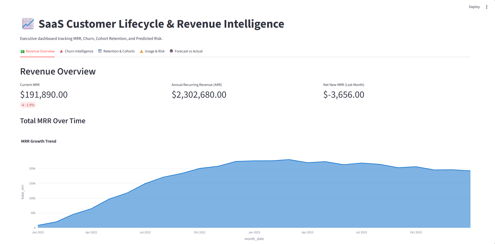

# 🚀 SaaS Revenue Retention & Churn Intelligence Engine


> 🔴 **LIVE DEMO AVAILABLE**  
> *This application is deployed live! To interact with the executive dashboard, view the ML predictions, and explore the SaaS metrics, the active link is in the **"Deployments"** section on the **right sidebar of this GitHub repository**.*

## 📌 Business Problem & Objective

Subscription-based SaaS platforms live and die by **Net Revenue Retention (NRR)** and **Customer Churn**.
The goal of this project is to move beyond basic e-commerce metrics and build a highly scalable, end-to-end Analytics Engineering pipeline that:

1. Calculates complex SaaS financial metrics (MRR Bridge: New, Expansion, Contraction, Churn).
2. Identifies early usage-based churn signals before a user cancels.
3. Forecasts future revenue.
4. Provides executives with an interactive intelligence dashboard.

---

## 🏗️ Architecture & Tech Stack

This project implements a **Medallion Architecture** (Bronze, Silver, Gold layers), combining a robust Data Engineering pipeline with an advanced Analytics & Machine Learning layer.

* **Data Generation & ETL (Bronze):** `Python`, `Pandas`, `Faker`
* **Data Warehouse & Analytics Engine (Silver/Gold):** `PostgreSQL` (Materialized Views, Window Functions, CTEs)
* **Predictive Modeling (Python Analytics Layer):** `Scikit-Learn` (Linear Regression), rule-based ML risk segmentation
* **BI & Data App:** `Streamlit`, `Plotly`

---

## 📊 The Executive Dashboard



---

## ⚙️ Core System Modules

### 1. SQL Analytics Engine (The Gold Marts)

Designed to mimic a `dbt` (Data Build Tool) project structure:

* **`core_mrr_movements`**: Uses `LAG()` window functions and `UNION ALL` logic to build a financial MRR bridge, tracking exactly how revenue expands and contracts at the customer level.
* **`core_cohort_retention`**: Calculates month-over-month survival rates for user cohorts to identify drop-off cliffs.
* **`core_churn_metrics`**: Distinguishes between **Voluntary** (user canceled) and **Involuntary** (payment failed) churn.
* **`fct_usage_signals`**: A wide feature table joining support tickets, login events, and feature usage to map behavioral engagement.

### 2. Python ML & Predictive Layer

* **6-Month MRR Forecast (`forecast_model.py`)**: Connects to the SQL engine and uses Scikit-Learn to project future revenue trends.
* **Risk Segmentation (`risk_segmentation.py`)**: An algorithm that classifies active users into **High, Medium, or Low Risk** based on sharp drops in feature usage combined with customer tenure.

---

## 📂 Repository Structure

```text
SaaS-Revenue-Retention-Engine/
├── data/raw/                 # Bronze Layer: Synthetic CSVs
├── sql/
│   ├── schema/               # DDL: Base table definitions
│   ├── staging/              # Silver Layer: Data cleanup & standardization
│   └── marts/                # Gold Layer: Materialized Views (MRR, Cohorts)
├── src/
│   ├── data_generator.py     # Generates millions of realistic mock rows
│   ├── etl_loader.py         # Connects to and loads data into Postgres
│   ├── forecast_model.py     # Scikit-Learn MRR prediction
│   ├── risk_segmentation.py  # User risk classification
│   └── dashboard.py          # Streamlit/Plotly executive app
├── config/database.ini       # DB credentials
├── main.py                   # Master orchestrator script
└── README.md
```

## 💡 Key Business Insights Discovered

Based on the synthetic data generation and analytics engine:

**Early Churn is Usage-Driven:** Users whose feature engagement drops by more than 15 actions within their first 90 days have a significantly higher probability of voluntary churn.

**Involuntary Churn Impact:** Roughly 5% of monthly churn is driven purely by failed payments, highlighting the need for a better dunning/retry system.

**Cohort Stabilization:** The retention heatmap shows the steepest drop-off occurs between Month 2 and Month 3. Users who survive past Month 4 become highly sticky "power users."

---

## 🚀 How to Run the Project Locally

### 1. Clone the repository & install dependencies:

```bash
git clone https://github.com/your-username/SaaS-Revenue-Retention-Engine.git
cd SaaS-Revenue-Retention-Engine
python -m venv venv
source venv/bin/activate  # On Windows use: venv\Scripts\activate
pip install -r config/requirements.txt
```

### 2. Configure your database:

Add your PostgreSQL credentials to `config/database.ini`.

### 3. Run the Data Pipeline (The Master Switch):

```bash
python main.py
```

(Note: After the ETL step runs, execute the SQL files in `sql/marts/` inside your database to build the analytical views before the ML models run.)

### 4. Launch the Dashboard:

```bash
streamlit run src/dashboard.py
```
---
